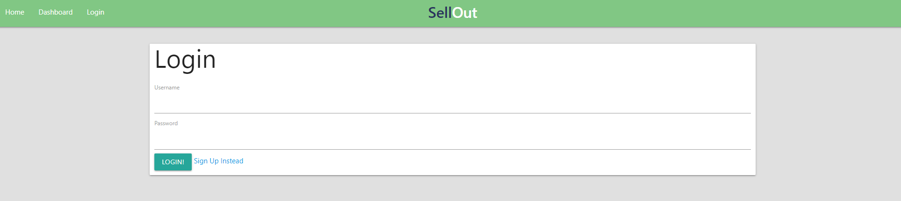
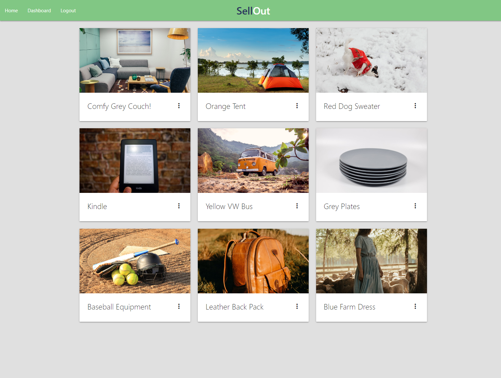
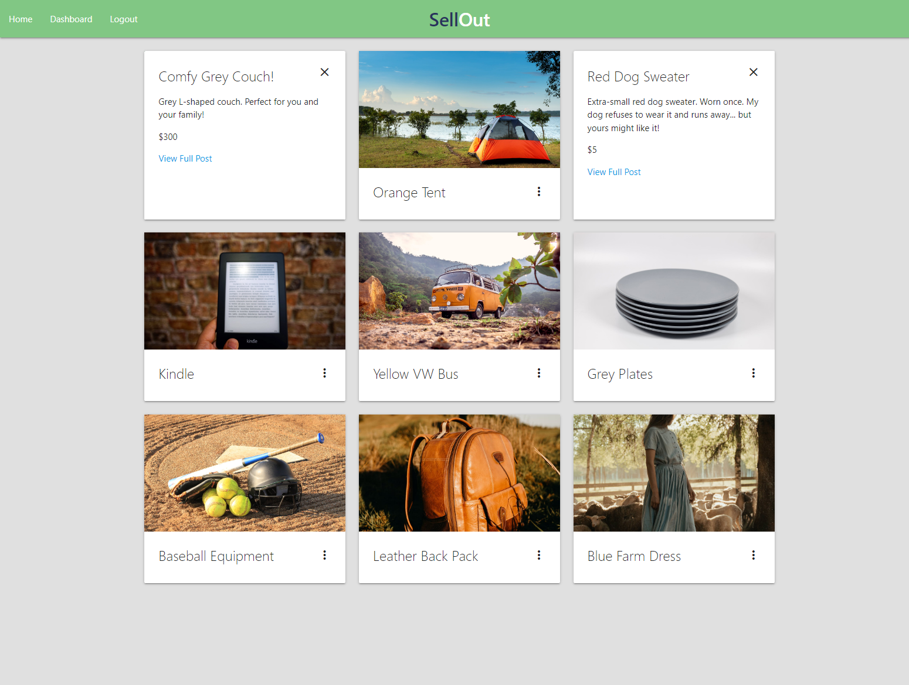
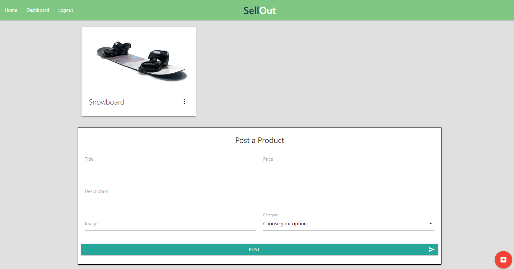
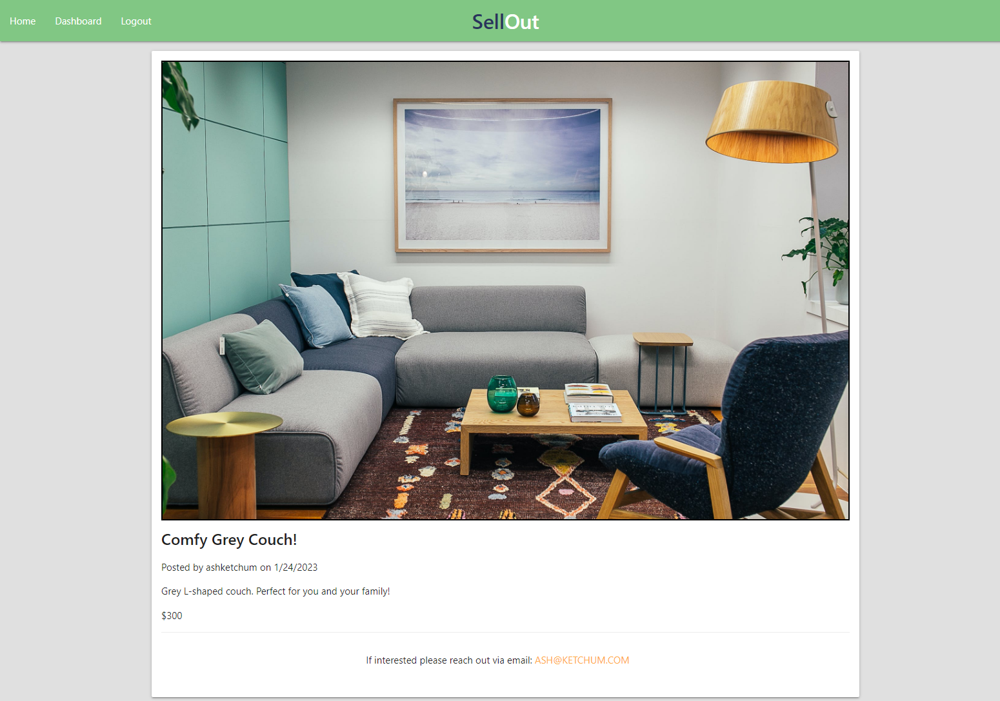

# Marketplace Application

GitHub Repository: https://github.com/ZoeRorvig/market-application

## Description

    Introducing SellOut the newest marketplace app here to make your online shopping experience secure, fast and easy! Use SellOut to offload and sell your unwanted goods and/or buy someone else's with just the press of a button. Users will find SellOut's layout to be aesthetically pleasing and easy to navigate so that anyone can be apart of the community. 

    Similar applications often fail provide a secure environment for community users. Online marketplaces tend to be plagued by scams and false advertisment. During the creation of this application data security has been made a priority and includes authentication processes to protect our users. 

    This application was construted using a number of frameworks, including: JavaScript, Node.js, Express.js, Handlebars.js & Sequelize. SellOut uses the design language Materialize CSS for much of the application's visual styling.  

## Table of Contents

  [Visuals](#visuals)

  [Installation](#installation)

  [Usage](#usage)

  [Contributing](#contributing)

  [Authors & Acknowledgement](#authors-&-acknowledgment)

  [License](#license)

  ## Visuals

## Installation 
  
  n/a
  
## Usage
  
  n/a

## Contributing 
  
    Pull requests are welcome. For major changes, please open an issue first to discuss what you would like to change.

    Please make sure to update tests as appropriate. 

## Authors & Acknowledgement

    For any questions please feel free to reach out through the accounts listed below:

* Zoë Rorvig - [ZoeRorvig](https://github.com/ZoeRorvig)
* Taz Lowry - [Deiontre10](https://github.com/Deiontre10)
* Chris Bonime - [Cujion](https://github.com/Cujion)
* Terrance Smith - [NewDev2298](https://github.com/NewDev2298)

## License
* MIT License

* Copyright (c) [2023]] [Zoë Rorvig, Taz Lowry, Chris Bonime, Terrance Smith]

* Permission is hereby granted, free of charge, to any person obtaining a copy
of this software and associated documentation files (the "Software"), to deal
in the Software without restriction, including without limitation the rights
to use, copy, modify, merge, publish, distribute, sublicense, and/or sell
copies of the Software, and to permit persons to whom the Software is
furnished to do so, subject to the following conditions:

* The above copyright notice and this permission notice shall be included in all
copies or substantial portions of the Software.

* THE SOFTWARE IS PROVIDED "AS IS", WITHOUT WARRANTY OF ANY KIND, EXPRESS OR
IMPLIED, INCLUDING BUT NOT LIMITED TO THE WARRANTIES OF MERCHANTABILITY,
FITNESS FOR A PARTICULAR PURPOSE AND NONINFRINGEMENT. IN NO EVENT SHALL THE
AUTHORS OR COPYRIGHT HOLDERS BE LIABLE FOR ANY CLAIM, DAMAGES OR OTHER
LIABILITY, WHETHER IN AN ACTION OF CONTRACT, TORT OR OTHERWISE, ARISING FROM,
OUT OF OR IN CONNECTION WITH THE SOFTWARE OR THE USE OR OTHER DEALINGS IN THE
SOFTWARE.